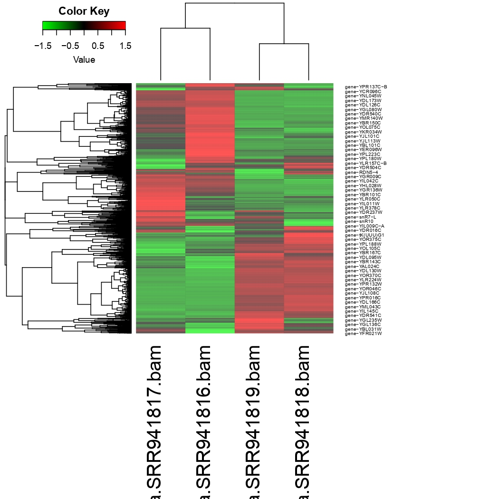

# Differential RNA expression analysis
## 1. Input data
I will explore how RNA expression levels change as yeast undergo fermentation to make bread rise. There are two replicates of RNA-seq data from yeast before and during fermentation, and our goal is to find out if the yeast express different genes during fermentation than they do under normal growth.<br>
As a reference genome I will use Saccharomyces cerevisiae, in the genome database at NCBI, strain S288c and assembly R64. I download the reference genome in FASTA format, annotation in GFF format and reference transcriptome (RNA) in fasta format.<br>
## 2. Analysis Pipeline
Here I use the following software:<br>
- HISAT2 version 2.2.1 <br>
- gffread v0.12.1. <br>

### 2.1. Aligning with HISAT2
Building genome index:<br>
run hisat2-build<br>
```bash
hisat2-build <reference.fasta> <genome index>
```
In my case:
```bash
hisat2-build ./data/GCF_000146045.2_R64_genomic.fna ./data/index
```
run hisat2 in single-end mode:
```bash
hisat2 -p [number of threads] -x [path to HISAT2 index] -U [FASTQ file] | samtools sort > out.bam
```
In my case:
```bash
hisat2 -p 4 -x ./data/index -U ./data/SRR941816.fastq | samtools sort > ./data/SRR941816.bam
```
The output:
```bash
9043877 reads; of these:
  9043877 (100.00%) were unpaired; of these:
    512971 (5.67%) aligned 0 times
    7930597 (87.69%) aligned exactly 1 time
    600309 (6.64%) aligned >1 times
94.33% overall alignment rate
```
```bash
hisat2 -p 4 -x ./data/index -U ./data/SRR941817.fastq | samtools sort > ./data/SRR941817.bam
```
The output:
```bash
9929568 reads; of these:
  9929568 (100.00%) were unpaired; of these:
    505208 (5.09%) aligned 0 times
    8645398 (87.07%) aligned exactly 1 time
    778962 (7.84%) aligned >1 times
94.91% overall alignment rate
```
```bash
hisat2 -p 4 -x ./data/index -U ./data/SRR941818.fastq | samtools sort > ./data/SRR941818.bam
```
The output:
```bash
1721675 reads; of these:
  1721675 (100.00%) were unpaired; of these:
    65074 (3.78%) aligned 0 times
    1508006 (87.59%) aligned exactly 1 time
    148595 (8.63%) aligned >1 times
96.22% overall alignment rate
```
```bash
hisat2 -p 4 -x ./data/index -U ./data/SRR941819.fastq | samtools sort > ./data/SRR941819.bam
```
The output:
```bash
6172452 reads; of these:
  6172452 (100.00%) were unpaired; of these:
    229681 (3.72%) aligned 0 times
    5368136 (86.97%) aligned exactly 1 time
    574635 (9.31%) aligned >1 times
96.28% overall alignment rate
```
### 2.2. Quantifying with featureCounts
featureCounts can not work with GFF files. We need to convert the GFF file to GTF format. For this purpose we will use gffread.<br>
Install gffread:
```bash
sudo apt-get install gffread 
```
Convert from GFF to GTF:
```bash
gffread <input GFF> -T -o <output GTF>
```
In my case:
```bash
conda run gffread ./data/GCF_000146045.2_R64_genomic.gff -T -o ./data/GCF_000146045.2_R64_genomic.gtf
```
Run the feature counts program:
```bash
featureCounts -g gene_id -a <annotation file> -o <output file> 
<input file(s) - SAM/BAM>
```
In my case:
```bash
conda run featureCounts -g gene_id -a data/GCF_000146045.2_R64_genomic.gft -o data/featureCounts_res.txt data/SRR941816.bam data/SRR941817.bam data/SRR941818.bam data/SRR941819.bam
```
We don’t need all columns from featureCounts output file for further analysis, so let’s simplify it.<br>
Simplify the counts:
```bash
cat <output file from featureCounts> | cut -f 1,7-10 > simple_counts.txt
```
In my case:
```bash
cat data/featureCounts_res.txt | cut -f 1,7-10 > data/simple_counts.txt
```
### 2.3. Find differentially expressed genes with Deseq2
I will use 2 scripts containing in ./cade<br>
calculate metrics:
```bash
cat data/simple_counts.txt | R -f code/deseq2.r
```
draw heatmap:
```bash
cat data/norm-matrix-deseq2.txt | R -f code/draw-heatmap.r
```
I see<br>

## 3. Result Interpretation

